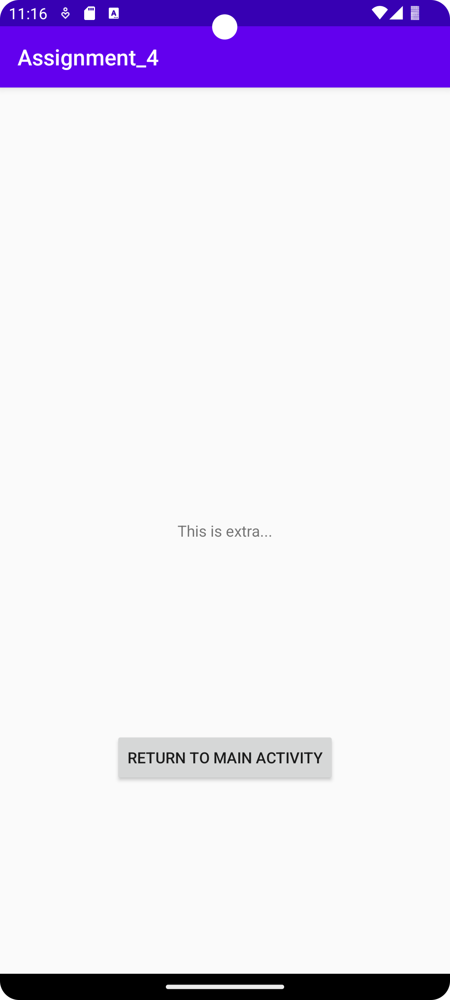

# Rapport

Jag började med att lägga till en andra aktivitet. Då det inte fungerade
att göra det som vanligt via file > new var jag tvungen att göra det
manuellt. Efter det skapade jag en button i activity_main.xml (Se kodexempel nedan). 
Därefter skapade jag en intent för button elementet för att man skulle kunna klicka på den
vilket laddar in SecondActivity. Jag gjorde likadant för att det skulle finnas en knapp som
tar en tillbaka till MainActivity-sidan. Jag lade sedan in en extratext med namnet "info" och
värdet "This is extra..." som skickas med intenten. Detta value visas sedan upp i en TextView
på SecondActivity. Slutligen ändrade jag namnet på appen till "Assignment_4".

```
<Button
        android:layout_width="wrap_content"
        android:layout_height="wrap_content"
        android:id="@+id/button_mainactivity"
        android:text="@string/button_mainactivity"
        app:layout_constraintTop_toBottomOf="@id/textview1"
        app:layout_constraintBottom_toBottomOf="parent"
        app:layout_constraintRight_toRightOf="parent"
        app:layout_constraintLeft_toLeftOf="parent"
        />
```


